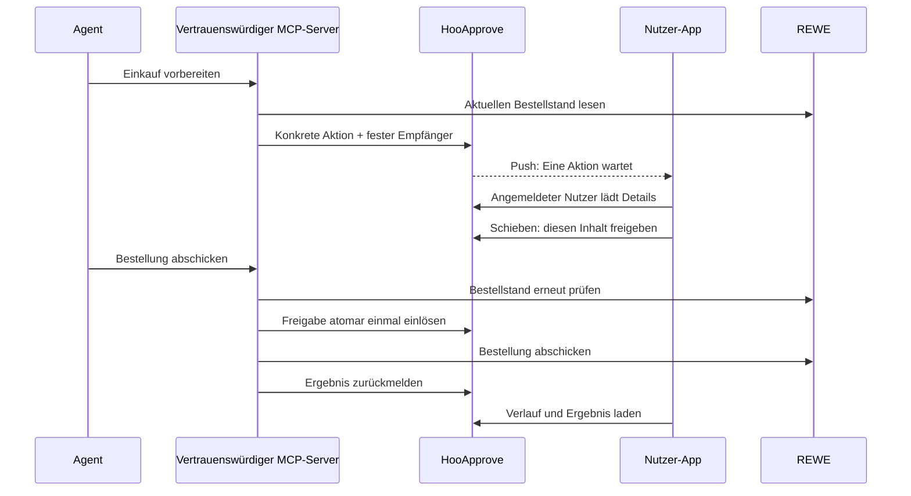

# HooApprove

**Du entscheidest, bevor dein Agent etwas Verbindliches tut.**

Allgemeiner Freigabedienst mit nativer iOS-/Android-App und ergänzender Desktop-Weboberfläche.
Ein MCP-Server kann einen Einkauf vorbereiten und eine Anfrage auf das Handy schicken.
Erst nach der menschlichen Entscheidung darf der vertrauenswürdige Server die konkrete Aktion
einmal einlösen und ausführen.

## Veröffentlichung

[Android-Vorschau herunterladen](https://github.com/openhoo/hooapprove/releases/download/v0.1.0-preview.2/hooapprove-android-arm64.apk) ·
[Alle Preview-Releases](https://github.com/openhoo/hooapprove/releases) ·
[Gehosteter Dienst](https://approve.openhoo.dev)


Quellcode: `openhoo/hooapprove`. Die Preview-Releases enthalten ein Android-APK,
den Helm-Chart, Prüfsummen und den unveränderlichen Container-Digest. Die Android-Pakete
sind ARM64 und debug-signiert. Preview 1 ist eine lokale Demo; ab Preview 2 verwendet
die App den gehosteten HTTPS-Dienst. Beide enthalten das App-Bundle und benötigen
keinen Metro-Server. Nur für die lokale Demo nach Start des Demo-Dienstes:

```sh
adb reverse tcp:8097 tcp:8097
adb install hooapprove-demo-android-arm64.apk
```

Der veröffentlichte Quellcode und die APKs belegen keine App-Store-Freigabe
und keine echte REWE-Bestellung. Der tatsächliche Dienst-Rollout wird separat
in `docs/verification.md` dokumentiert. Push benötigt noch die EAS/APNs/FCM-Einrichtung.

## Enthalten

- Native App mit offenen Anfragen, vollständigen Aktionsdetails, Schieben zum Freigeben,
  Ablehnen, Verlauf, optionaler Biometrie und nativen Push-Benachrichtigungen.
- OpenHoo-Anmeldung im Systembrowser; App-Sitzung im geschützten Gerätespeicher.
- Freigabe-API mit Nutzer-/Diensttrennung, Ablauf, Inhaltsbindung, Idempotenz und atomarem Claim.
- Dauerhafte SQLite-Speicherung mit Ereignisverlauf und gesonderten Ausführungsergebnissen.
- Python-Client und Beispieladapter; direkte Anbindung an den vorhandenen `shooping`-MCP
  im separaten Arbeitsbaum `../shooping-hooapprove`.
- Container, Helm-Chart, CI-Prüfungen und lokale Demo.

## Ablauf



Die Sperre sitzt im ausführenden Dienst. Ein Hinweis im Agent-Prompt ersetzt diese Sperre nicht.
Der Agent darf weder die menschliche Sitzung noch direkte Bestellzugangsdaten besitzen.

## Lokal ansehen

```sh
uv sync --frozen
HOOAPPROVE_DEMO=1 uv run uvicorn hooapprove.app:create_app --factory \
  --host 127.0.0.1 --port 8097 --no-access-log
```

Öffne `http://127.0.0.1:8097`, melde dich im Demo-Modus an und erstelle eine Beispielanfrage.
Die Demo sendet keine REWE-Bestellung und funktioniert ausschließlich auf Loopback.
Eine Demo-Anfrage kann genehmigt werden; sie behauptet keine tatsächliche Ausführung.

## Native App

```sh
cd native
npm ci
npm run check
npx expo export --platform ios --platform android
```

Die API-Adresse wird bei einem Build durch `EXPO_PUBLIC_HOOAPPROVE_URL` festgelegt.
Die Produktionsadresse ist `https://approve.openhoo.dev`. Der Dienst ist ausgerollt;
die live geprüften Abläufe und offenen Handytests stehen in [docs/verification.md](docs/verification.md).

Eine App-Anmeldung öffnet `/auth/login` im Systembrowser. Der OIDC-Callback erstellt ein
60 Sekunden gültiges, einmaliges Übergabeticket. Der native Client löst dieses mit seinem
zufälligen PKCE-Verifier ein. Das daraus entstehende Sitzungstoken wird nur gehasht auf dem
Server gespeichert und auf dem Gerät in SecureStore abgelegt; es läuft nach zwölf Stunden ab.
Abmelden widerruft diese Sitzung und entfernt die Push-Registrierung des Geräts.

Push erfordert ein zugeordnetes EAS-Projekt sowie APNs-/FCM-Einrichtung.
`native/eas.json` enthält Entwicklungs-, Vorschau- und Produktionsprofile.
Der lokale Android-Build benötigt kein EAS-Konto:

```sh
cd native
EXPO_PUBLIC_HOOAPPROVE_URL=http://127.0.0.1:8097 npx expo prebuild --platform android --no-install
docker build --platform linux/amd64 -f Dockerfile.android -t hooapprove-android-builder:amd64 .
docker run --rm --platform linux/amd64 --cpus=6 --memory=10g \
  --env EXPO_PUBLIC_HOOAPPROVE_URL=http://127.0.0.1:8097 --env NODE_ENV=production \
  --mount type=bind,src="$PWD",dst=/build \
  --mount type=volume,src=hooapprove-native-node-modules,dst=/build/node_modules \
  --mount type=volume,src=hooapprove-gradle-cache,dst=/root/.gradle \
  hooapprove-android-builder:amd64 bash -lc \
  'npm ci --include=dev --no-audit --no-fund && cd android && ./gradlew assembleRelease --no-daemon --max-workers=3 -PreactNativeArchitectures=arm64-v8a'
```

Dieses Vorschaupaket verwendet den Android-Debugschlüssel, enthält ein eingebettetes Bundle
und benötigt keinen laufenden Metro-Server. Es ist kein Play-Store-Release.
iOS-Verteilung über TestFlight benötigt die Apple-Team-/Signiereinrichtung.

## API für Dienste

Service-Zugangsdaten dürfen nur im ausführenden Dienst liegen.

| Endpoint | Zweck |
| --- | --- |
| `POST /v1/requests` | Neue Anfrage erstellen; identischer Idempotenzschlüssel liefert die bestehende Anfrage |
| `GET /v1/requests/{id}` | Status für den ursprünglichen Dienst lesen |
| `POST /v1/requests/{id}/claim` | Genau diese genehmigte Anfrage einmal zur Ausführung beanspruchen |
| `POST /v1/requests/{id}/result` | `completed`, `failed` oder `uncertain` melden |
| `POST /v1/requests/{id}/cancel` | Noch nicht beanspruchte Anfrage zurückziehen |

Eine Anfrage enthält `subject`, `action`, `title`, `summary`, vollständige `details`,
den auszuführenden `payload`, einen `idempotency_key` und `expires_in` (30–1800 Sekunden).
Dienst, Empfänger, Aktion, sichtbarer Inhalt und Payload sind gemeinsam durch den Digest gebunden.
Der serverseitig konfigurierte Empfänger darf kein beliebiges Toolargument sein.

```python
from hooapprove.client import ApprovalClient
from hooapprove.models import ActionRequest

# Retrieve token through the executor's protected secret custody; never give it to the model.
client = ApprovalClient(url, token, "rewe")
action = ActionRequest(
    subject=authenticated_owner_subject,
    action="order.place",
    title="Deinen Einkauf bestellen",
    summary="Prüfe die vollständige Bestellung.",
    details=authoritative_order_details,
    payload=immutable_order_payload,
    idempotency_key=order_revision,
    expires_in=300,
)
request = client.request(action)
# Return request ID/status to the agent; the human approves in the app.
# Before execution, derive current_action again from authoritative upstream state.
reference = client.execute(request["id"], current_action, place_exact_order)
```

`place_exact_order(payload, execution_id)` muss den festen Payload ausführen und, wenn vom
Upstream unterstützt, dessen Idempotenz- und Versionsbedingungen benutzen. Der Client wiederholt
Mutationen nicht. Verlorene Antworten nach dem Claim bleiben gesperrt; sie lösen keinen zweiten
Versuch aus. Ein identischer Ergebnisbericht kann gefahrlos erneut gespeichert werden.

## Konfiguration und Betrieb

Produktionsmodus startet nur mit HTTPS, OIDC-Client und einem mindestens 32 Zeichen langen
Sitzungsschlüssel. `HOOAPPROVE_SECRETS_FILE` verweist auf ein geschütztes, zur Laufzeit gemountetes
JSON-Secret mit `session_secret`, `client_id`, `client_secret` und `services`.

`services` enthält je Dienst einen starken `token` und eine ausdrückliche Liste erlaubter
OpenHoo-Subject-IDs unter `subjects`. Es gibt keine Wildcard-Empfänger.
Für Web-Push sind zusätzlich `vapid_private_key` und `vapid_public_key` erforderlich.
Native Push-Tokens werden nach menschlicher Anmeldung registriert.

Weitere Variablen: `HOOAPPROVE_DATABASE`, `HOOAPPROVE_PUBLIC_URL`, `HOOAPPROVE_ISSUER`.
Der OIDC-Callback ist `<public-url>/auth/callback`.

Das Helm-Chart in `deploy/` setzt einen einzelnen Prozess mit dauerhaftem Volume und
`Recreate`-Updates ein. Infrastrukturänderungen erfolgen über `hooapps-gitops`; Image-Digest,
OpenBao/ExternalSecret, TLS, DNS, OIDC-Registrierung und Backup müssen vor dem Rollout konkret
bereitstehen. `deploy/values.yaml` enthält deshalb kein fiktives veröffentlichtes Image.
Das Chart erzeugt keine Zugangsdaten und installiert keine unbestätigten Identitäten.

SQLite-Backups mit der SQLite-Backup-API erstellen; nicht allein die DB-Datei während eines
WAL-Betriebs kopieren. Der Ereignisverlauf ist kein gegen Datenbankadministratoren manipulationssicheres Log.
Eine zurückgespielte ältere Datenbank kann konsumierte Freigaben wiederbeleben. Vor Restore
Ausführung anhalten; offene/genehmigte Anfragen verwerfen und bereits gestartete Vorgänge mit
dem externen Bestellzustand abgleichen.

## Nachweis und Grenzen

Die Abnahme steht in [docs/verification.md](docs/verification.md), die Sicherheitsgrenze in
[docs/architecture.md](docs/architecture.md), die Shooping-Anbindung in
[docs/shooping.md](docs/shooping.md).

Native TypeScript-/Bundle-Prüfungen und ein erzeugtes APK ersetzen keinen Gerätetest.
Ein erfolgreicher synthetischer Checkout ersetzt keine echte REWE-Bestellung.
Biometrie in dieser Version ist eine zusätzliche lokale App-Prüfung, keine vom Server überprüfte
Transaktionssignatur. Push-Zustellung ist derzeit best effort; die Inbox bleibt die Statusquelle.

Lizenz: Apache-2.0. Keine Analytics oder Upstream-Telemetrie in der Anwendung.
