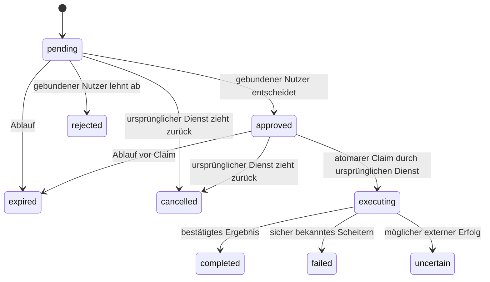

# Sicherheits- und Integrationsvertrag

## Zustände

Kein Endzustand führt automatisch zu einer neuen Genehmigung. Ein hängender `executing`-Vorgang
ist ebenfalls nicht erneut einlösbar. Ablehnen, Ablaufen oder Netzwerkfehler bedeutet niemals „ja“.

## Durchsetzung

1. Der vertrauenswürdige Executor kennt den angemeldeten Eigentümer. Der Agent wählt keinen Subject.
2. Der Executor liest den echten Aktionsstand und erzeugt daraus sowohl Darstellung als auch Payload.
3. Die App zeigt den Ursprungsdienst, den vollständigen Vertrag und einen kurzen Inhaltsfingerabdruck.
4. Nur menschliche OIDC-/App-Sitzungen können entscheiden. Dienst-Tokens können es nicht.
5. Der Executor liest vor Ausführung den Aktionsstand erneut. Jede Änderung braucht eine neue Freigabe.
6. Ein Claim prüft Dienst, Digest, Zustand und Ablauf in einer `BEGIN IMMEDIATE`-Transaktion.
7. Das externe System muss eigene Idempotenz-/Versionsbedingungen erzwingen, soweit unterstützt.
8. Ergebnisse werden separat gemeldet; Freigabe bedeutet nicht abgeschlossene Bestellung oder Zahlung.

Eine universelle Freigabe-API kann keine ungeschützte alternative Bestellroute sperren.
Direkte Upstream-Credentials gehören zu einem isolierten Dienstkonto, auf das der Agent keinen
Datei-/Shell-Zugriff besitzt. Wenn der Agent dieselben OS-Rechte wie der Executor hat, kann er
eine reine MCP-Sperre umgehen. Das Deployment muss diese Rollen tatsächlich trennen.

Auch ein manipuliertes vertrauenswürdiges Backend könnte falsche Angaben darstellen oder ohne
Claim bestellen. Der Dienst ist Teil der Vertrauensgrenze. Der Digest schützt Inhaltsbindung und
Wiederverwendung; er ersetzt keine korrekte Ableitung der sichtbaren Angaben.

## Menschliche Identität

Authlib führt OIDC-Codeaustausch, State-/Nonce- und ID-Token-Prüfung aus. Die App erhält keine
OIDC-Client-Secrets. Native Tickets sind kurzlebig, gehasht gespeichert, einmal einlösbar und
an einen PKCE-Verifier gebunden. Native Sitzungen sind zufällig, gehasht gespeichert und widerrufbar.
Browserentscheidungen benötigen Same-Origin und CSRF-Token. Kein CORS für fremde Ursprünge.

Biometrie ist optional und lokal. Eine verbindliche, serverprüfbare Bindung von Nutzergerät,
Biometrie und Transaktionsinhalt erfordert in einer weiteren Version registrierte Geräteschlüssel
und signierte Challenges mit Plattformattestierung. Diese Version behauptet keine bankrechtliche
eTAN- oder Strong-Customer-Authentication-Konformität.

## Benachrichtigungen und Datenschutz

Push enthält nur „Eine Aktion wartet auf deine Entscheidung“. Details, Adresse, Betrag,
Anmeldedaten und Freigabebefugnisse werden nicht in Lock-Screen-Nachrichten übertragen.
Native Nachrichten laufen über den Expo-Pushdienst; der Dienst erhält Geräte-Push-Tokens und
generische Benachrichtigungstexte. Die Details lädt die App ausschließlich angemeldet aus HooApprove.
Eine Notification-Tap-Aktion öffnet die Inbox; sie bestätigt nichts.

Push hat aktuell weder dauerhafte Outbox noch externe Receipt-Nachverfolgung. Bei fehlgeschlagener
Zustellung bleibt die Anfrage in der Inbox. Gerätetest und Zustellnachweis gehören zur Produktionsabnahme.

Freigaben enthalten private Aktionsdaten. Datenbank, Backups und betriebliches Logging müssen
entsprechend geschützt werden. Keine Token, Cookie-Header, OIDC-Callbacks oder Query-Tickets loggen;
Uvicorn läuft deshalb ohne Access-Log, und der Reverse Proxy muss dieselbe Regel erhalten.

## Betrieb

Eine Instanz mit SQLite und dauerhaftem Volume. Horizontale Skalierung braucht einen anderen
transaktionalen Store und gemeinsame Auth-/Notification-Zustände. Ingress muss zusätzlich
Verbindungs-/Ratenlimits und angemessene Timeouts setzen. Die Anwendung begrenzt Request-Bodies.

Wiederherstellungen können Freigabe-Replay verursachen. Ausführung erst wieder aktivieren, nachdem
alle offenen Freigaben verworfen und externe Wirkungen abgeglichen wurden. Bei verlorener Claim-
Antwort findet kein automatischer Versand statt. Bei verlorener Bestellantwort muss der Eigentümer
die Upstream-Historie prüfen; eine neue Freigabe allein ist kein Nachweis, dass vorher nichts geschah.
